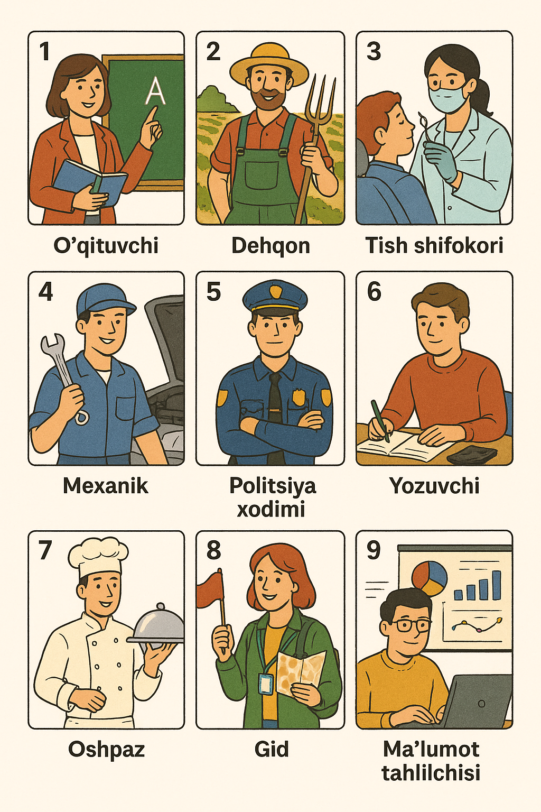
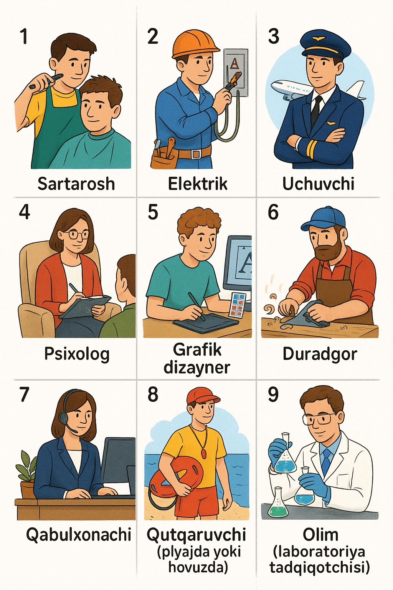
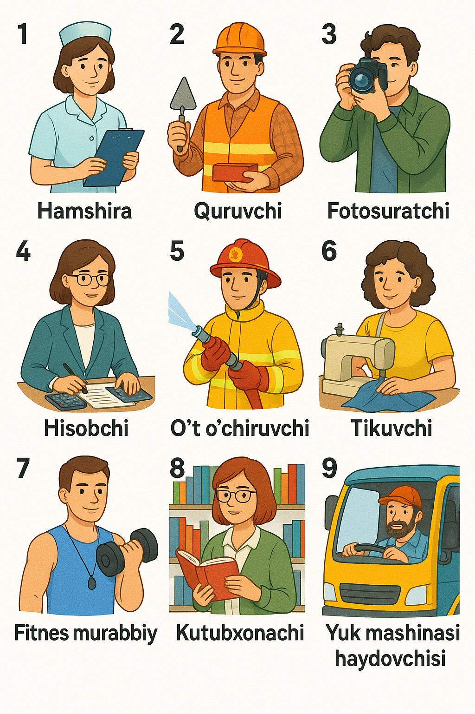

### Section 1: Uzbek (Pre-Intermediate) — Relative Clauses with -adigan

#### Lesson focus
- Form and use relative clauses built with the participle ending -adigan/-yadigan to describe nouns (who/that …).
- Build very simple noun phrases like ishlaydigan odam (a person who works) and short sentences using these phrases.

#### What is -adigan?
- In Uzbek, we often describe a noun by putting a verb before it with the ending -adigan (or -yadigan). This makes an adjective-like phrase meaning “who/that … (does)” in a general, present/future sense.
- Pattern: [Verb] + -adigan/-yadigan + [Noun]
  - Meaning: “a/an [Noun] who/that [Verb]”

Examples (given):
- Kulgili odam – boshqalarni kuldira oladigan odamdir.  
  “A funny person is a person who can make others laugh.”
- Hozir kompyuter ishlata olmaydigan ko‘p odamlar ishidan ayrilishi mumkin.  
  “Nowadays, many people who cannot use a computer may lose their jobs.”

#### How to form it (quick guide)
- Positive: Verb + -adigan (or -yadigan after a vowel sound)
  - ishlamoq → ishlaydigan (who/that works)
  - o‘qimoq → o‘qiydigan (who/that studies/reads)
- Negative: Verb + -maydigan
  - ishlamoq → ishlamaydigan (who/that does not work)
- Ability (can/cannot): Verb + olmoq + -adigan / -maydigan
  - kuldirmoq → kuldira oladigan (who/that can make [someone] laugh)
  - ishlatmoq → ishlata olmaydigan (who/that cannot use)

Note on word order: The -adigan phrase comes BEFORE the noun it describes.

#### Very simple noun phrase examples
- ishlaydigan odam — a person who works
- o‘qiydigan talaba — a student who studies
- ingliz tilida gapiradigan o‘qituvchi — a teacher who speaks English
- ishlamaydigan kompyuter — a computer that doesn’t work
- tez pishadigan non — bread that bakes quickly
- kuladigan bola — a child who laughs

#### Very simple sentence examples
- Bu ishlaydigan telefon. — This is a phone that works.
- Men ingliz tilida gapiradigan o‘qituvchini qidiryapman. — I’m looking for a teacher who speaks English.
- Biz tez pishadigan nonni yoqtiramiz. — We like bread that bakes quickly.
- U o‘qiydigan talaba. — He/She is a student who studies.
- Bu ishlamaydigan kompyuter. — This is a computer that doesn’t work.

#### Mini practice
1) Make noun phrases with -adigan:
   - (ishlamoq + odam) → __________ odam  
   - (gapirmoq + o‘qituvchi) → __________ o‘qituvchi  
   - (yashamoq + shahar) → __________ shahar  

2) Make negative phrases with -maydigan:
   - (kelmoq + mehmon) → __________ mehmon  
   - (yordam bermoq + do‘st) → __________ do‘st  

3) Ability (can/cannot) with olmoq:
   - (yordam bermoq + olmoq + odam) → __________ odam  
   - (suzmoq + olmoq + bola) → __________ bola  

Check your answers by reading them aloud and translating: “a [noun] who/that …”

#### Quick teacher notes (usage reminders)
- -adigan/-yadigan usually expresses general, habitual, or future meaning (“who/that does/will do”).  
- For past descriptions, Uzbek uses -gan (e.g., kelgan odam — the person who came), but that is beyond today’s scope.

### Section 2: Combine the fragments with -adigan

1️⃣
- Many people eat too much. They can get sick.
- Many people who eat too much can get sick.
- Ko‘p odam juda ko‘p ovqat yeydi. Ular kasal bo‘lishi mumkin.

2️⃣
- Children play outside a lot. They are usually happy.
- Children who play outside a lot are usually happy.
- Bolalar ko‘p tashqarida o‘ynaydi. Ular odatda baxtli bo‘ladi.

3️⃣
- Students read every day. They can learn better.
- Students who read every day can learn better.
- O‘quvchilar har kuni o‘qiydi. Ular yaxshiroq o‘rganishi mumkin.

4️⃣
- People don’t sleep well. They often feel tired.
- People who don’t sleep well often feel tired.
- Odamlar yaxshi uxlamaydi. Ular ko‘pincha charchagan bo‘ladi.

5️⃣
- People help each other. They can live peacefully.
- People who help each other can live peacefully.
- Odamlar bir-biriga yordam beradi. Ular tinch yashashi mumkin.

6️⃣
- Animals live in the forest. They find food there.
- Animals who live in the forest find food there.
- Hayvonlar o‘rmonda yashaydi. Ular o‘sha yerda ovqat topadi.

7️⃣
- My friends study hard. They get good grades.
- My friends who study hard get good grades.
- Mening do‘stlarim tirishib o‘qiydi. Ular yaxshi baho oladi.

8️⃣
- People eat fruits every day. They stay healthy.
- People who eat fruits every day stay healthy.
- Odamlar har kuni meva yeydi. Ular sog‘lom bo‘ladi.

9️⃣
- Drivers use their phones. They can cause accidents.
- Drivers who use their phones can cause accidents.
- Haydovchilar telefon ishlatadi. Ular avariya qilishi mumkin.

🔟
- People work hard. They achieve their goals.
- People who work hard achieve their goals.
- Odamlar ko‘p ishlaydi. Ular maqsadiga erishadi.

11️⃣
- Children watch too much TV. They don’t play outside.
- Children who watch too much TV don’t play outside.
- Bolalar juda ko‘p televizor ko‘radi. Ular tashqarida o‘ynamaydi.

12️⃣
- People live near the sea. They like to swim.
- People who live near the sea like to swim.
- Odamlar dengiz yaqinida yashaydi. Ular suzishni yoqtiradi.

13️⃣
- Teachers work at school. They help students learn.
- Teachers who work at school help students learn.
- O‘qituvchilar maktabda ishlaydi. Ular o‘quvchilarga o‘rganishga yordam beradi.

14️⃣
- People read books. They learn new things.
- People who read books learn new things.
- Odamlar kitob o‘qiydi. Ular yangi narsalarni o‘rganadi.

15️⃣
- Some people wake up early. They have more time.
- People who wake up early have more time.
- Ba’zi odamlar erta turadi. Ularning vaqti ko‘proq bo‘ladi.

16️⃣
- My sister cooks dinner every night. She makes tasty food.
- My sister who cooks dinner every night makes tasty food.
- Singlim har kecha kechki ovqat pishiradi. U mazali ovqat tayyorlaydi.

17️⃣
- People go to the gym. They become stronger.
- People who go to the gym become stronger.
- Odamlar sportzalga boradi. Ular kuchli bo‘ladi.

18️⃣
- Students use dictionaries. They can understand new words.
- Students who use dictionaries can understand new words.
- O‘quvchilar lug‘atdan foydalanadi. Ular yangi so‘zlarni tushunadi.

19️⃣
- People travel a lot. They learn about other cultures.
- People who travel a lot learn about other cultures.
- Odamlar ko‘p sayohat qiladi. Ular boshqa madaniyatlarni o‘rganadi.

20️⃣
- My dad fixes cars. He knows a lot about engines.
- My dad who fixes cars knows a lot about engines.
- Otam mashina tuzatadi. U dvigatellar haqida ko‘p narsani biladi.

21️⃣
- People drink a lot of water. They feel better.
- People who drink a lot of water feel better.
- Odamlar ko‘p suv ichadi. Ular o‘zini yaxshi his qiladi.

### Keys (Section 2 — Combined Uzbek sentences)
1) Juda ko‘p ovqat yeydigan ko‘p odamlar kasal bo‘lishi mumkin.
2) Ko‘p tashqarida o‘ynaydigan bolalar odatda baxtli bo‘ladi.
3) Har kuni o‘qiydigan o‘quvchilar yaxshiroq o‘rganadi.
4) Yaxshi uxlamaydigan odamlar ko‘pincha charchagan bo‘ladi.
5) Bir-biriga yordam beradigan odamlar tinch yashashi mumkin.
6) O‘rmonda yashaydigan hayvonlar o‘sha yerda ovqat topadi.
7) Tirishib o‘qiydigan do‘stlarim yaxshi baho oladi.
8) Har kuni meva yeydigan odamlar sog‘lom bo‘ladi.
9) Telefon ishlatadigan haydovchilar avariya qilishi mumkin.
10) Ko‘p ishlaydigan odamlar maqsadiga erishadi.
11) Juda ko‘p televizor ko‘radigan bolalar tashqarida o‘ynamaydi.
12) Dengiz yaqinida yashaydigan odamlar suzishni yoqtiradi.
13) Maktabda ishlaydigan o‘qituvchilar o‘quvchilarga o‘rganishga yordam beradi.
14) Kitob o‘qiydigan odamlar yangi narsalarni o‘rganadi.
15) Erta turadigan odamlarning vaqti ko‘proq bo‘ladi.
16) Har kecha kechki ovqat pishiradigan singlim mazali ovqat tayyorlaydi.
17) Sportzalga boradigan odamlar kuchli bo‘ladi.
18) Lug‘atdan foydalanadigan o‘quvchilar yangi so‘zlarni tushunadi.
19) Ko‘p sayohat qiladigan odamlar boshqa madaniyatlarni o‘rganadi.
20) Mashina tuzatadigan otam dvigatellar haqida ko‘p narsani biladi.
21) Ko‘p suv ichadigan odamlar o‘zini yaxshi his qiladi.

### Section 3: Guess the Job (Kasbni toping)

Oddiy qoidalar (sodda tilda):
- Avval rasmlarga qarang. Har rasmda 9 ta kasb bor.
- Bitta talaba bitta kasbni o‘ylaydi va “Tayyorman” deydi.
- Boshqa talabalar faqat ha/yo‘q savollar beradi.
- Savollarda -adigan/-maydigan ishlatamiz.
- Kim to‘g‘ri topasa, navbat o‘sha talabaga o‘tadi.

Namunaviy savollar:
- Bu tashqarida ishlaydigan odammi?
- Bu ichkarida ishlaydigan odammi?
- Bu ishda ko‘p gapiradigan odammi?
- Bu kompyuter bilan ishlaydigan odammi?

Rasm 1:

1) Teacher — O‘qituvchi
2) Farmer — Dehqon
3) Dentist — Tish shifokori
4) Mechanic — Mexanik
5) Police officer — Politsiya xodimi
6) Writer — Yozuvchi
7) Chef — Oshpaz
8) Tour guide — Gid
9) Data analyst — Ma’lumot tahlilchisi

Rasm 2:

1) Nurse — Hamshira
2) Construction worker — Quruvchi
3) Photographer — Fotosuratchi
4) Accountant — Hisobchi
5) Firefighter — O‘t o‘chiruvchi
6) Tailor — Tikuvchi
7) Fitness trainer — Fitnes murabbiyi
8) Librarian — Kutubxonachi
9) Truck driver — Yuk mashinasi haydovchisi

Rasm 3:

1) Hairdresser — Sartarosh
2) Electrician — Elektrik
3) Pilot — Uchuvchi
4) Psychologist — Psixolog
5) Graphic designer — Grafik dizayner
6) Carpenter — Duradgor
7) Receptionist — Qabulxonachi
8) Lifeguard — Qutqaruvchi (plyajda yoki hovuzda)
9) Scientist (lab researcher) — Olim (laboratoriya tadqiqotchisi)
